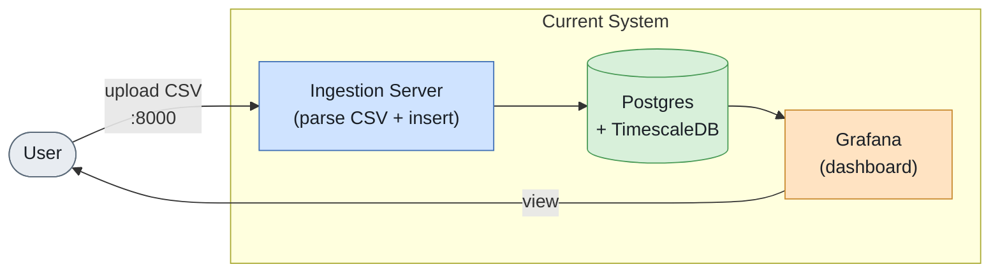
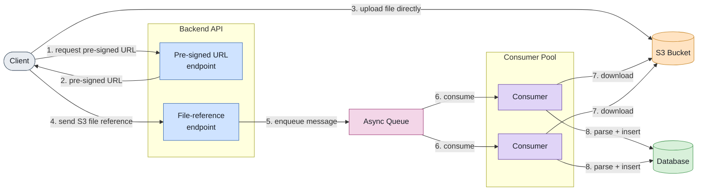
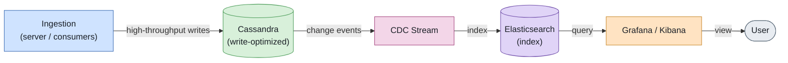

# Architecture

## Current architecture

1. A CSV file is uploaded directly to the data ingestion server (`localhost:8000`).
2. The server parses the CSV in-process and inserts the records into a Postgres database with the TimescaleDB extension enabled.
3. The `timestamp` column is indexed (via TimescaleDB hypertables) for efficient time-series queries (daily buckets, time range filters, etc.).
4. Grafana connects to Postgres as a data source and visualizes the data through the dashboard panels.

This is simple and works well for the current scale: small-to-medium CSV files, a single writer, and a dashboard that mostly does read-side aggregation.

## Where this breaks down at scale

- The upload, parsing, and DB insert all happen synchronously in one request on one server. A large file (or many concurrent uploads) ties up server memory/CPU/connections for the whole duration of the request, and a slow client upload holds a server thread open the entire time.
- There's no decoupling between "receiving a file" and "processing a file" — a burst of uploads can overwhelm the ingestion server or the database with simultaneous bulk inserts.
- Postgres, while fine for moderate write volume, isn't built specifically for very high-throughput writes when the workload is write-intensive (append-heavy ingestion of large volumes of social media posts).

## Optimization strategy 1: offload uploads to S3 + async processing

**Approach:**

1. Client requests a pre-signed S3 URL from the backend API.
2. Client uploads the CSV directly to S3 using that URL (bypassing the app server entirely).
3. Client notifies the backend API with just the S3 object reference (not the file itself).
4. The backend API pushes a message (containing the S3 reference) onto an async queue.
5. A pool of queue consumers picks up messages, downloads the file from S3, parses it, and inserts records into the database.

**Reasoning / when this is useful:**

- File transfer workload moves off the app server and onto S3, which is built to handle large, concurrent uploads reliably.
- Parsing/insertion workload moves off the request path and onto a pool of consumers that can be scaled independently and can retry/backoff without affecting the upload experience.
- The app server itself only ever handles small, cheap requests (issuing pre-signed URLs, receiving a file reference), so it stays lightly loaded regardless of file size or upload volume.
- This is most valuable when files are large and/or uploads happen at scale (many concurrent uploads, or occasional very large files) — the whole point is to prevent a spike in upload traffic from ever reaching or congesting the main service. For small, infrequent uploads (the current use case), the added complexity of S3 + a queue + consumers isn't worth it yet.

## Optimization strategy 2: write-optimized storage + CDC into a search/analytics store

**Approach:**

- Replace (or supplement) Postgres with a database optimized for high-throughput writes, such as Cassandra, for storing raw ingested posts.
- Use Change Data Capture (CDC) to stream changes out of that database as they happen.
- Feed the CDC stream into Elasticsearch, indexing the data for fast aggregation and search.
- Point Grafana (or Kibana) at Elasticsearch as the data source for dashboards/analysis.

**Reasoning / when this is useful:**

- This system's workload is write-intensive (continuous ingestion of social media posts), and Cassandra is designed specifically for high write throughput and horizontal write scalability, which Postgres is not optimized for at large scale.
- CDC decouples the write path from the analytics/read path entirely — ingestion never has to wait on or compete with indexing/analytics work, and the analytics store can be rebuilt or reindexed independently.
- Elasticsearch is purpose-built for the kind of aggregation, filtering, and full-text search that dashboards need, and scales well for read-heavy analytical queries over large datasets.
- This is most useful once ingestion volume is high enough that a single relational database becomes a write bottleneck, or once dashboard queries need capabilities (fast full-text search, complex aggregations across huge datasets) that push past what Postgres/TimescaleDB can comfortably serve. For the current scale, Postgres + TimescaleDB already gives efficient time-series querying with far less operational complexity than running Cassandra + a CDC pipeline + Elasticsearch.

## Summary

| Strategy | Solves | Cost | Adopt when |
|---|---|---|---|
| S3 pre-signed upload + async queue consumers | Upload/parsing load on the app server | Extra moving parts: S3, queue, consumer pool | Large files and/or high upload concurrency |
| Cassandra + CDC + Elasticsearch | Write throughput ceiling and analytical query needs | Significant operational complexity: new DB, CDC pipeline, search cluster | Ingestion volume or query needs outgrow Postgres/TimescaleDB |

Both are scaling strategies for future growth, not requirements for the current system — introduce them when the specific bottleneck they solve is actually being hit.
